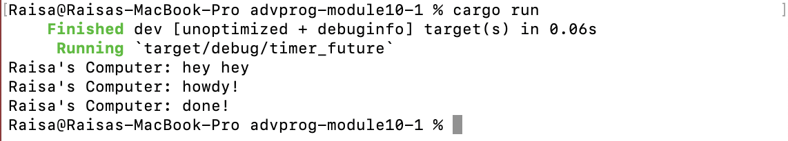
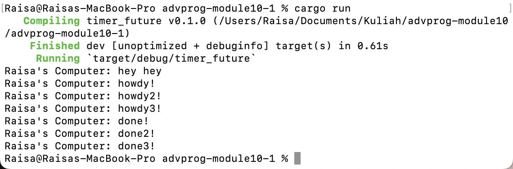
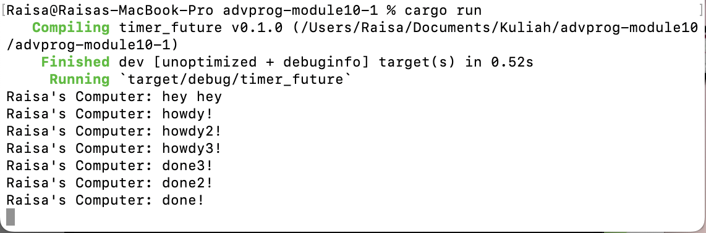

# Tutorial 10 

## 1.2 Understanding How It Works

When we spawn an async task, it runs alongside the main function, not within it. So, any code outside the async task, such as 'Raisa's Computer: hey hey', can execute independently.

## 1.3 Multiple Spawn and Removing Drop
**With drop(spawner)**

**Without drop(spawner)**

The spawner is responsible for adding tasks to the execution queue, while the executor manages the execution of these tasks. Therefore, `drop(spawner)` signals the end of task addition, allowing the executor to complete existing tasks before termination. It can be seen in the screenshot that without `drop(spawner)`, the executor continues to wait for new tasks, causing existing tasks to execute immediately. However, with `drop(spawner)` present, the executor understands that no new tasks will be added, ensuring that the remaining tasks in the queue are completed before termination.